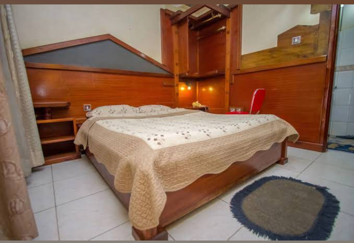

# Join the Google Developer Community

This contains everything you need to run your app locally.

Another one with Google Devs I/O: https://ai.studio/apps/ab72aca1-e9ff-4182-a45c-8edbc8c4aea0

## Run Locally use Electron Chromium Wrapper

**Prerequisites:**  Node.js

1. You know the drill:
   `npm install`
   
2. :
   `npm run dev`
